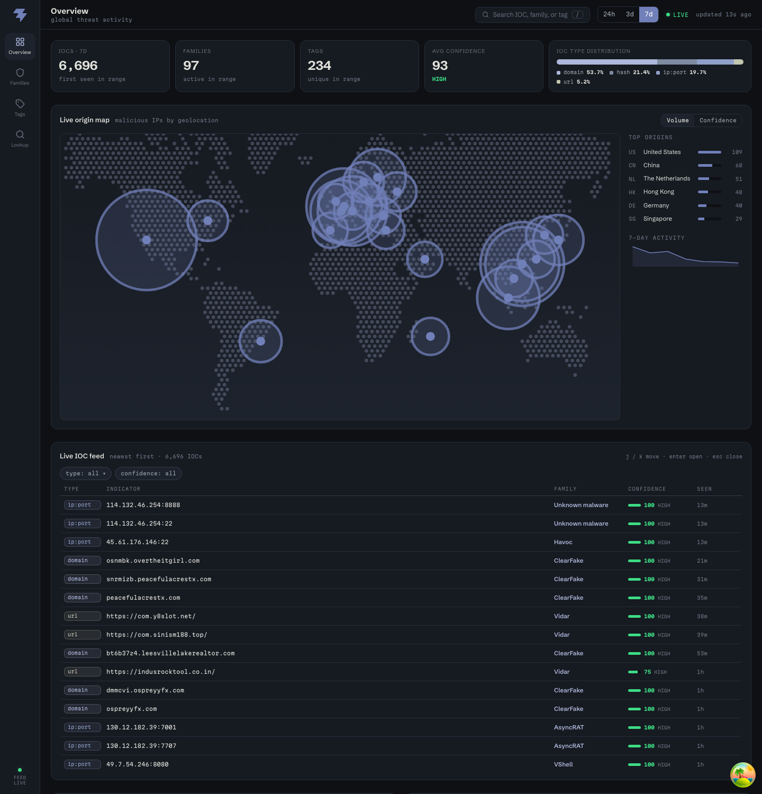
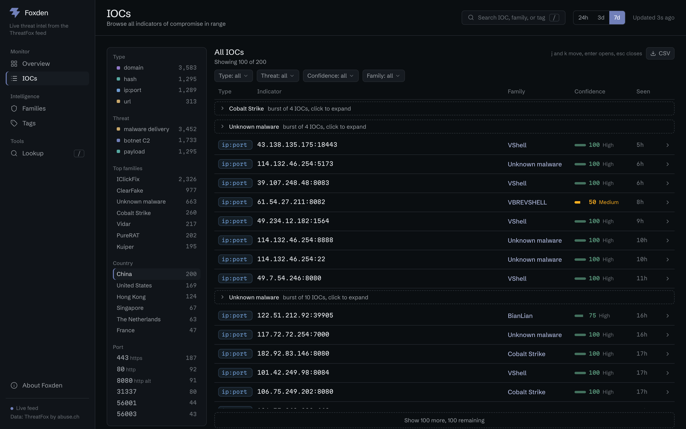
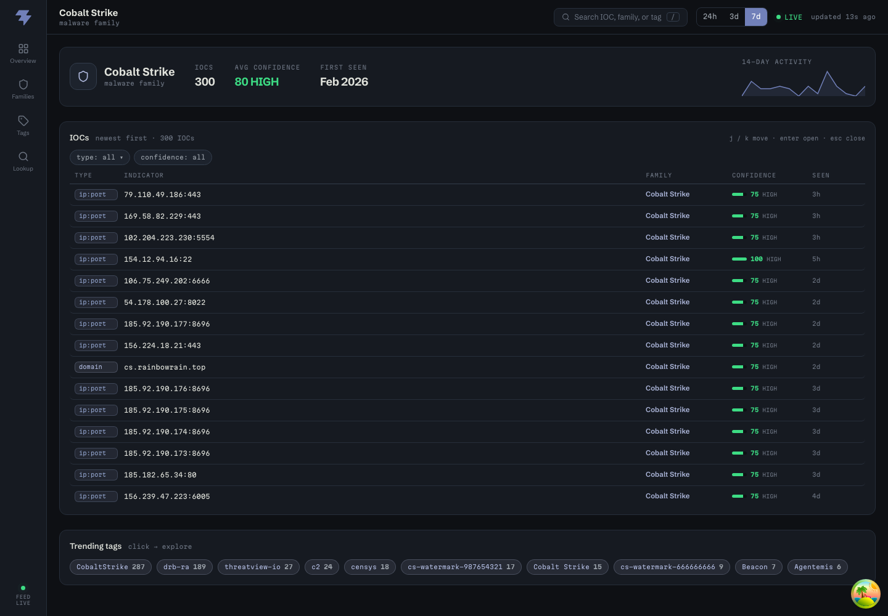

# Foxden

A live threat intelligence dashboard built on the [abuse.ch ThreatFox](https://threatfox.abuse.ch/) feed.
It shows what is attacking, from where, right now.



## What it does

Foxden takes the raw ThreatFox stream of IOCs (indicators of compromise, meaning malicious IPs, domains, URLs, and file hashes) and turns it into a dashboard you can actually work in. The overview gives you the situation, every value on screen pivots to the group it names, and details open in place.

- Overview with headline numbers and deltas, an activity curve, and the type and threat breakdown for the selected range (24h, 3d, or 7d)
- Origin map shaded by a thermal ramp, with a toggle between volume and confidence. Countries are clickable and land on the browse page prefiltered
- Browse page with a live facet rail: type, threat use, family, country, and port are all filters, the filters live in the URL so a view is shareable, and the filtered list exports to CSV
- Families page ranking every malware operation, with a campaign timing heatmap showing when each one works and who is spiking against their own baseline
- Tags page sizing the community's labels in a treemap and separating meaningful labels from noise
- Family and tag pages you can share, with stats, activity, that entity's IOCs, and a link out to its ThreatFox page
- Click any IOC anywhere and a detail panel opens next to the feed with copy, tags, siblings, and links out to VirusTotal and ThreatFox
- Press / anywhere to look up any IP, domain, URL, or hash and get a verdict in a second
- Watch families and tags you care about and the overview reports their activity when you return
- Keyboard support in every feed: j and k to move, enter to open, esc to close





## Stack

Frontend: React 19 with the React Compiler, Vite, Tailwind v4, TanStack Query, d3-geo, d3-hierarchy.
Backend: FastAPI. A small proxy that keeps the ThreatFox key on the server, validates input, caches responses, and rate limits per client.
Type: Schibsted Grotesk for the interface, Martian Mono for all data values.
Data: ThreatFox API from abuse.ch, plus ip-api.com for geolocation.

## Run it locally

Backend. You need a free Auth-Key from https://auth.abuse.ch/

```bash
cd backend
python3 -m venv venv && source venv/bin/activate
pip install -r requirements.txt
cp .env.example .env   # paste your THREATFOX_API_KEY
uvicorn main:app --port 8000 --reload
```

Frontend:

```bash
cd frontend
npm install
npm run dev            # opens on http://localhost:5173
```

The Vite dev server proxies /api to the backend, so there is nothing else to configure in dev.

## Deploy

Both halves run free on Vercel's hobby plan, no credit card.

Backend: import the repo as a project with the root directory set to backend. Vercel detects the FastAPI app in main.py on its own. Set THREATFOX_API_KEY and ALLOWED_ORIGINS (your frontend URL) in the environment.

Frontend: import the repo again as a second project with the root directory set to frontend. Set VITE_API_BASE_URL to the backend URL. vercel.json ships the security headers and single page routing. Cloudflare Pages works too, the `_headers` and `_redirects` files in frontend/public carry the same config.

Render or any container host also runs the backend, the Dockerfile is generic and render.yaml documents the settings.

## Security notes

- The ThreatFox key never reaches the browser. Every upstream call goes through the backend.
- Every endpoint validates its input bounds. The geo endpoint only forwards valid public IPs.
- CORS is locked to ALLOWED_ORIGINS, responses are cached to respect upstream rate limits, and each client is rate limited by real IP behind the proxy.
- Reference links only render for http and https URLs, and CSV exports neuter spreadsheet formula characters.
